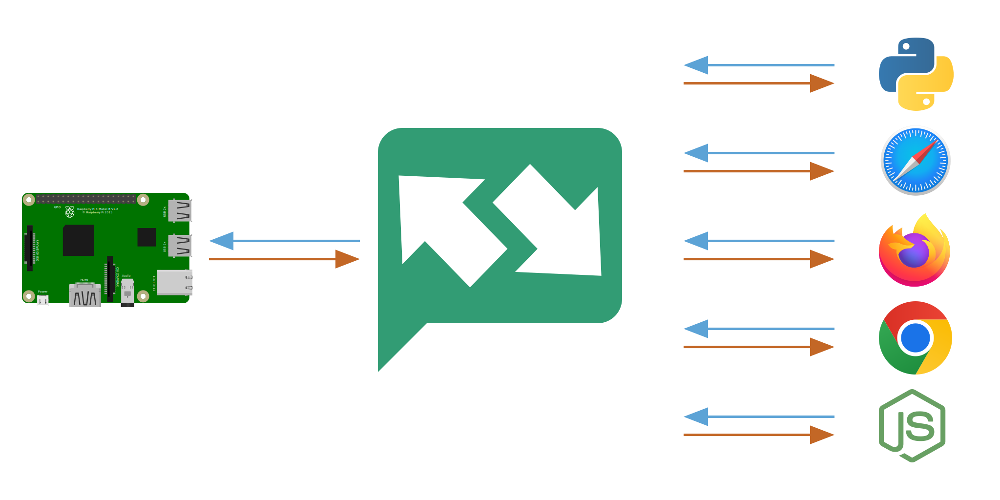

<p align="center">
	
</p>

<p align="center">
	<em>The simple messaging service</em>
	<h1 align="center">
		staticpi.com backend
	</h1>
</p>

<p align="center">
	currently powering <a href='https://www.staticpi.com' target='_blank' rel='noopener noreferrer'>staticpi.com</a>
</p>

<p align="center">
	Built in <a href='https://www.rust-lang.org/' target='_blank' rel='noopener noreferrer'>Rust</a>
	for <a href='https://www.docker.com/' target='_blank' rel='noopener noreferrer'>Docker</a>,
	using <a href='https://www.postgresql.org/' target='_blank' rel='noopener noreferrer'>PostgreSQL</a>
	& <a href='https://www.redis.io/' target='_blank' rel='noopener noreferrer'>Redis</a>.
	<br>
	This is the backend for <a href='https://www.github.com/mrjackwills/staticpi_vue' target='_blank' rel='noopener noreferrer'>staticpi_vue</a> front-end, and is an on-going work in progress.
</p>

<p align="center">
	<a href="https://raw.githubusercontent.com/mrjackwills/staticpi_backend/main/.github/diagram_o.svg" target='_blank' rel='noopener noreferrer'>
		
</p>

<hr>

<p align="center">
	<br>
	The backend is a CRUD api, token server, and websocket message forwarder, with the following features;
	<ul>
		<li><a href="https://github.com/tokio-rs/axum" target='_blank' rel='noopener noreferrer'>axum</a> based with <a href='https://www.tokio.rs' target='_blank' rel='noopener noreferrer'>tokio</a> async mutlithreading</a>
		<li>Websocket connection & message forwarding</li>
		<li>Time sensitive, IP locked, token generation</li>
		<li>Password hashing with argon2</li>
		<li>Weak password resolution & rejection, powered by <a href='https://haveibeenpwned.com/' target='_blank' rel='noopener noreferrer'>hibp</a></li>
		<li>Time based Two-Factor Authentication</li>
		<li>Two-Factor Authentication backup codes</li>
		<li>User sessions using private cookie with a redis backend</li>
		<li>Redis based multitudinous rate limiting</li>
		<li>Automated email templating & sending, using <a href='https://mjml.io/' target='_blank' rel='noopener noreferrer'>mjml</a></li>
		<li>User & Admin user accounts</li>
		<li>Restricted User area</li>
		<li>Restricted Admin user area</li>
		<li>strict CORS settings for API, but open CORS for websocket & token server</li>
		<li>Customised incoming serde serialization & extraction</li>
		<li>Error tracing</li>
		<li>Internal "Contact Us" messaging</li>
		<li>Redis based cache</li>
		<li>Postgres main data store</li>
		<li>Scheduled automated database backup & encryption</li>
		<li>(attempted complete) test coverage</li>
		<li>Automated github build step</li>
		<li>Fully Dockerised production environment</li>
		<li>Development remote container (using <a href="https://code.visualstudio.com/docs/remote/containers" target='_blank' rel='noopener noreferrer'>vscode</a>)</li>
	</ul>
<p>

## Download

See <a href="https://github.com/mrjackwills/staticpi_api/releases" target='_blank' rel='noopener noreferrer'>releases</a>

download (x86_64_linux one liner)

```shell
wget https://www.github.com/mrjackwills/staticpi_backend/releases/latest/download/staticpi_linux_x86_64.tar.gz &&
tar xzvf staticpi_linux_x86_64.tar.gz staticpi
```

## Run

Operate docker compose containers via

```shell
./run.sh
```

## Build

```shell
cargo build --release
```

<strike>
Build using cross-rs, for x86_64 linux musl targets, in order to run in an Alpine based container

```shell
cross build --target x86_64-unknown-linux-musl --release
```
</strike>

## Tests

Requires postgres & redis to both be operational and built with valid structure - <a href="https://github.com/mrjackwills/staticpi_backend/blob/main/src/docker.init/init_db.sql" target='_blank' rel='noopener noreferrer'>init_db.sql</a>.

```shell
# Watch
cargo watch -q -c -w src/ -x 'test -- --test-threads=1 --nocapture'

# Run all 
cargo test -- --test-threads=1 --nocapture


# cargo taupalin -- --test-threads=1
# Test coverage, requires cargo-llvm-cov to be installed globally
# then: `rustup component add llvm-tools-preview --toolchain 1.61.0-x86_64-unknown-linux-gnu
cargo llvm-cov -- --test-threads=1
```
